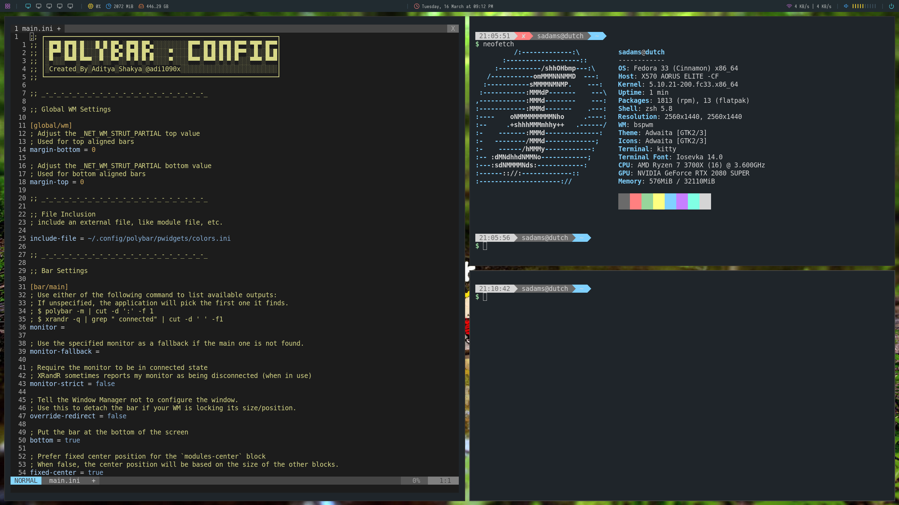

# Getting started with bspwm on Linux

Install, configure, and start using the bspwm window manager on Fedora Linux

Some folks like to rearrange furniture. Some folks like to try new shoes, or redecorate their bedroom on the regular. Me? I try out Linux desktops.

After drooling over some of the incredible desktop environments I've seen on [Reddit](https://unixporn.reddit.com) I got curious about one window manager in particular: [bspwm](https://github.com/baskerville/bspwm). I've been a fan of the [i3](https://i3wm.org/) window manager for quite a while and I do enjoy the way everything is laid out, and the ease at getting started. But something was calling to me about bspwm. There are a few reasons I decided to try it out.

* It is _only_ a window manager
* It is managed by a few easy to configure scripts
* It supports gaps between windows by default

It simply being a window manager is probably the thing that's best pointed out about it. Like i3, there are no graphical bells and whistles applied by default. You can certainly customize it to your heart's content, but you are going to be putting in all the work to make it look exactly like you want. That's part of the appeal to me, and I'll be sharing a few easy tricks to make it look a little snazzier later in this article.

Though it is available on many distributions, my examples will all be with Fedora Linux.

## Installation

Bspwm is packaged in most common distributions, so all you must do is install it with your system's package manager. In the below example, we'll be installing [sxkhd](https://github.com/baskerville/sxhkd) as well.

    dnf install bspwm sxkhd

Now you have bspwm installed, but you'll want to get going with another tool before you try to use it: sxkhd. Since bspwm is _just_ a window manager, there aren't any built in shortcuts or keyboard commands available to it. This is where it stands in contrast to something like i3. In order to get going easily, we can go ahead and configure sxkhd before we even fire up the window manager for the first time.

    systemctl start sxkhd
    systemctl enable sxkhd

That enables sxkhd at login, but we'll also need a configuration that has some basic functionality ready to go.

    curl https://raw.githubusercontent.com/baskerville/bspwm/master/examples/sxhkdrc --output ~/.config/sxkhd/sxkhdrc

It's worth taking a look at this file before we get much futher, as some commands that are called by the scripts may not exist on your system. A good example is the `super + enter` shortcut which calls `urxvt`. You should change this to your preferred terminal in the event you do not have urxvt installed.

    #
    # wm independent hotkeys
    #
    
    # terminal emulator
    super + Return
    	urxvt
    
    # program launcher
    super + @space
    	dmenu_run
    
    # make sxhkd reload its configuration files:
    super + Escape
    	pkill -USR1 -x sxhkd

That's it! If you are using GDM, LightDM, or another display manager, all you have to do is choose bspwm before logging in.

## Configuration

Once you are logged in, you'll see a whole lot of nothing on the screen. That's not a feeling of emptiness you feel. It's possibility! You are now ready to start fiddling with all the parts of a desktop environment that you have taken for granted all these years. Building from scratch is not easy, but it's very rewarding once you get the hang of it

The most difficult thing about any window manager is getting a handle on the shortcuts. I usually keep the config file open in a window for quick reference while I'm getting used to the commands and navigating my system. You're going to be slow to start with, but in a short time, you'll be flying around your system just using your keyboard and looking like an ultimate hacker to your friends and family.

You can tailor the system as much as you want by editing `~/.config/bspwm/bspwmrc` to add apps at launch, setup your desktops/monitors, and set rules for how your windows should behave. A few examples are set by default to get you going. Keyboard shortcuts are all managed by the sxkhdrc file.

## Getting Fancy

Out of the box, we have nothing, but with a few simple package installs, we can start to have _something_.

To start with, no desktop is complete without your favorite wallpaper on it. We'll use an app called [feh](https://github.com/derf/feh) to make that happen. Feh will even remember what wallpaper was in place when it shuts down so it can put it back for you after reboots or logouts.

    feh --bg-scale some/path/to/picture

If you are used to having a bar of some sort to help you remember what time it is, or keep track of what windows you have open, [polybar](https://github.com/polybar/polybar) is one of the options to get that job done. It's a very popular and well supported statusbar, and happens to have support for bspwm out of the box. We could write an entire article on polybar alone. It's endlessly configurable and can add a lot of character to your now empty desktop.

    dnf install feh polybar

If you want to get polybar going quickly, you can find a fantastic resource for themes at [adi1090x's](https://github.com/adi1090x/polybar-themes) github page. It allows you to launch a fully functional, and useful polybar with a simple switch. For instance, opening the "Forest" theme is as easy as:

    ~/.config/polybar/launch.sh --forest

Missing those shadows and transparency that you love from other desktop managers? Download and add `compton` to your bspwmrc file

    dnf install compton
    echo "compton &" >> ~/.config/bspwm/bspwmrc

If you use multiple monitors, you'll definitely want to use `arandr` to configure those. It provides a graphical interface for arranging your monitors, and allows you to save that setting as a shell script that can be executed either as part of xinit or at the top of your bspwmrc file.

    dnf install arandr

## Inspiration

There are endless customizations available with tiling window managers like bspwm. If you ever wanted a system designed from the ground up to fit your aesthetic preferences and potentially look like a fake movie operating system, then give a window manager a try.

I love spending time on [Reddit]() browsing other desktops to get ideas, and most users share their dotfiles freely so you can use some of their ideas easily.

Enjoy!

 
